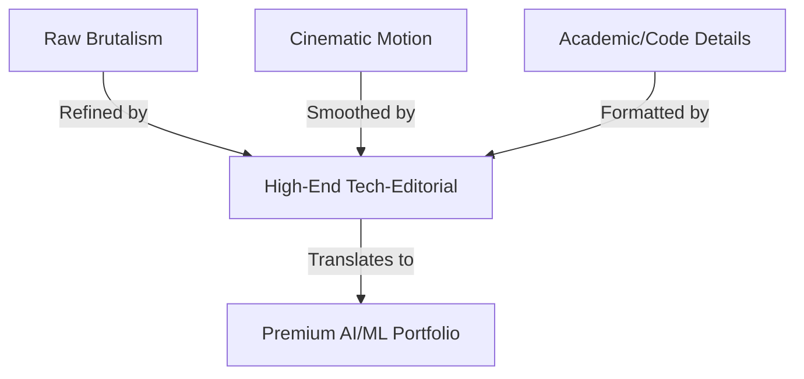

# Website Analysis: digitalists.at
*A detailed architectural, UI/UX, and motion design analysis for building a premium AI/ML Engineer portfolio.*

This document provides a deep-dive reverse-engineering of [digitalists.at](https://digitalists.at/), detailing how its technical aesthetics, cinematic flow, and performance-first architecture can serve as a blueprint for a high-end **AI/ML & Reinforcement Learning Developer** portfolio.

---

## 1. Overall Design Philosophy

### The "Refined Brutalism" Aesthetic
The website utilizes a design language known as **Refined Brutalism** (sometimes called *Tech-Editorial*). Traditional brutalism in web design is raw, intentionally unpolished, and high-contrast. `digitalists.at` tempers this raw feeling with smooth motion, pixel-perfect SVGs, and micro-interactions, resulting in a luxury, high-end technical aesthetic.



### Visual Psychology & Emotional Impact
*   **High-Agency Tech Authority:** The use of monospaced typography, terminal-like headers, and dot-matrix grid layouts communicates extreme technical fluency. It tells the visitor that the creator operates at the core of software construction, not just on the visual surface.
*   **Tactile Feedback:** Every scroll and hover changes the screen state in a noticeable way. This creates a "tangible digital interface" feel, making the user feel like they are operating a specialized console.
*   **The Power of Yellow (#f1e500):** Yellow is a warning/notice color, but in this high-tech context, it functions as a signature energetic accent. Coupled with deep blacks, it acts as a digital warning light, signaling speed, intelligence, and high-energy execution.

### Application to an AI/ML Portfolio
For an **AI/ML and Reinforcement Learning Developer**, this design philosophy is highly effective:
*   It mirrors code IDEs (VS Code), Jupyter notebooks, and mathematical typography (LaTeX), which immediately communicates academic and development competence.
*   Instead of a generic template, it establishes the developer as a high-value builder who values detail, performance, and advanced aesthetics.

---

## 2. Hero Section

### Layout Structure & Visual Hierarchy
The hero section is characterized by asymmetric simplicity. Rather than a massive 3D model or video background, it uses high-contrast typography, real-time metadata, and plenty of breathing room.

```
+-----------------------------------------------------------------------+
|  LOGO [digitalists]             BREADCRUMBS: Home   |   CLOCK & GREETING |
+-----------------------------------------------------------------------+
|                                                                       |
|  HERO SLOGAN (Large Serif/Display font)                               |
|  "What we do is what we love"                                         |
|                                                                       |
|  [DOT MATRIX PROGRESS BAR] . . . . . . . . . . . . . . . . . . . .    |
+-----------------------------------------------------------------------+
```

*   **Header Grid:** The top navbar contains the SVG text logo on the left, a structured schema-based breadcrumb trail in the center, and a typewriter-based greeting on the right.
*   **Typography Scale:** The main header utilizes massive, tightly kerned typography to instantly draw attention.
*   **CTA Placement:** Instead of standard primary/secondary buttons cluttering the view, call-to-actions are embedded naturally as text links ending in visual cues, or hidden in a persistent "TL;DR" overlay.
*   **Animation Sequencing (Entrance):**
    1.  **Solid Yellow Preloader:** A pure yellow background screen blocks the viewport, playing an 800ms loading sprite animation (7 steps) and a percentage counter that updates inside an SVG dot-grid bar.
    2.  **Slide-Up Exit:** The loading screen slides up out of view, revealing the dark site container.
    3.  **Typewriter Header Reveal:** The breadcrumbs and typewriter greeting initialize dynamically.
    4.  **Content Entrance:** Hero text and stacked images fade and translate up into place.

---

## 3. Typography System

The typography creates a strong contrast between editorial elegance and developer-centric monospaced layouts.

| Font Use Case | Typeface Style | Weight | Visual Psychology |
| :--- | :--- | :--- | :--- |
| **Headers & Hero Slogans** | Custom display serif/slab | Bold (700-800) | Editorial, premium, heavy contrast |
| **Interface Meta & Code** | `PP Fraktion Mono` (Monospace) | Regular / Medium | Technical, academic, terminal-like |
| **Body Copy & Description** | Clean, highly legible sans-serif | Light / Regular | High readability, clean space |

### Text Scaling & Readability Techniques
*   **Fluid Typography:** Font sizes are scaled dynamically using CSS calculations:
    ```css
    font-size: max(1rem, min(1.5vw, 1.5rem));
    ```
    This ensures that headings look massive on ultra-wide screens but scale gracefully on mobile without wrapping awkwardly.
*   **Vintage Code Glow:** Body text is colored with `--copy-yellow` (`#E6E4C7`). Against pure black, this off-white yellow mimics the phosphor glow of classic CRT terminals, reducing eye strain and reinforcing the retro-futuristic theme.

---

## 4. Layout & Grid System

The layout relies on a clean, structural layout divided by grids and custom borders.

```
+-----------------------------------------------------------------------+
|                        asymmetric layout border                       |
|   +---------------------------------+  +---------------------------+  |
|   |          Sticky Media Column    |  |    Scrolling Text Content |  |
|   |                                 |  |                           |  |
|   |   [Animated Project Image]      |  |   [Title H2]              |  |
|   |   (Fades/switches layers dynamically|  |   [Details text copy]     |  |
|   |    in sync with scroll state)   |  |   [CTA link]              |  |
|   +---------------------------------+  +---------------------------+  |
|                                                                       |
+-----------------------------------------------------------------------+
```

### Grid Behavior
*   **Custom Dot Separators:** Instead of standard browser borders (`border-bottom: 1px solid #ccc`), the site uses SVG patterns containing dot-matrix lines. This breaks up sections with a digital texture that feels like grid paper.
*   **Asymmetric Columns:** A standard 2-column layout is used for the stacked services section.
    *   **Left Column (Sticky Media):** Holds a stack of overlapping absolute-positioned images that fade in and out depending on the active index.
    *   **Right Column (Scrolling Details):** Contains the text and CTAs for each service, scrolling normally.
*   **Spacing Rhythm:** High spacing is used on desktop (`80px` margin bottom) to create a relaxed, premium pace. This collapses to `50px` on mobile to preserve layout integrity.

---

## 5. Motion Design

Motion is what makes this website feel premium. It uses a combination of micro-animations and page transitions to create a cohesive experience.

### Key Animation Techniques
*   **Single-Page-App (SPA) Feel on MPA:** The site uses **Barba.js** for smooth page transitions. When a link is clicked:
    1.  The click is intercepted.
    2.  An exit animation plays (a transition screen slide).
    3.  The main container contents (`#page`) are replaced via AJAX.
    4.  An entry animation plays.
    This prevents full page refreshes, maintaining WebGL state or scroll trackers in the background.
*   **Scroll-Triggered Stack Switching:** Using **GSAP ScrollTrigger**, the stacked services block pins the left column images. As the right column text scrolls into view:
    *   The corresponding image fades and scales in on the left.
    *   The dot-matrix progress indicator updates its filled dots.
*   **Hover Image Reveal (Cursor Follow):**
    For case study lists, the image does not stay static in a card. Instead, hovering over a list item reveals a floating image preview. The preview has an inertia effect, following the cursor's movements with a slight delay, creating a fluid, interactive feel.
*   **Speculation Rules API:**
    ```json
    {
      "prefetch": [
        {
          "source": "document",
          "where": { "and": [{ "href_matches": "/*" }] },
          "eagerness": "conservative"
        }
      ]
    }
    ```
    This instructs modern browsers to prefetch page links as the user hovers over them, making page transitions feel instant and zero-latency.

---

## 6. UX Flow & Interactive Features

### The TL;DR Dialog (Too Long To Read)
A standout UX feature is the custom `site-tltr` modal. Triggered easily, it pops up an HTML5 `<dialog>` that summarizes the entire agency.
*   **Dual-Scrolling Marquees:** Lists client names moving in opposite directions, creating visual interest.
*   **Grid Previews:** Shows quick case covers.
*   **Shortcuts:** Lists links to solutions and services, and includes a short contact form.
*   *ML Portfolio Application:* This is an exceptional pattern for recruiters. A developer's portfolio can be heavy with detailed research papers, math equations, and training code. A **"TL;DR / Quick Dashboard" modal** allows recruiters to immediately see key metrics (languages, papers published, core ML models trained, contact info) without scrolling.

### Accessibility-Focused Keyboard Navigation
Pressing **Ctrl+0** (or Option+0) triggers the `site-keyboard-nav` overlay.
*   Provides keyboard shortcuts to jump immediately to "Hauptmenü" (Header), "Inhalte" (Main Content), or "Footer".
*   Dynamically builds an index of all section headings.
*   *ML Portfolio Application:* Reflects a command-line interface (CLI) approach, highlighting the developer's attention to accessibility, keyboard ergonomics, and terminal-first thinking.

---

## 7. Color System

The color palette is restricted and impactful, creating an intelligent, high-contrast, yet readable interface.

| Color Variable | Hex Code | Purpose | Psychological Association |
| :--- | :--- | :--- | :--- |
| `--primary-2` | `#f1e500` | Preloader, dot highlights, primary brand | Energetic, highly visible, warning light |
| `--gray-50` | `#212121` | Main body/section backgrounds | Sleek dark mode, premium feel |
| `--copy-yellow` | `#E6E4C7` | Core typography/text color | Retro CRT phosphor glow, low eye-strain |
| `--secondary-2` | `#3AC3B6` | Accent colors, successes, buttons | Technological, clean cyan/teal |

### Contrast Strategy
By using off-white/warm yellow (`#E6E4C7`) instead of absolute white (`#FFFFFF`) on dark gray backgrounds, the website avoids high-contrast bloom. Text looks crisp and emits a gentle, glowing screen effect.

---

## 8. Component Patterns

### 1. Dotted Scroll & Progress Indicators
Custom SVG indicators that fill up dynamically based on state:
```xml
<svg class="services-stacked__progress" width="200" height="15">
  <defs>
    <pattern id="dots-inactive" width="4" height="4" patternUnits="userSpaceOnUse">
      <rect x="1" y="1" width="1.75" height="1.75" fill="#BFBFBF"/>
    </pattern>
    <pattern id="dots-active" width="4" height="4" patternUnits="userSpaceOnUse">
      <rect x="1" y="1" width="1.75" height="1.75" fill="black"/>
    </pattern>
  </defs>
  <rect class="active-dots" width="98" fill="url(#dots-active)"/>
  <rect class="inactive-dots" x="98" width="102" fill="url(#dots-inactive)"/>
</svg>
```

### 2. Cursor Follower Case Lists
*   List rows are separated by thin dotted grid lines.
*   On mouse hover, an image container fades in and smoothly translates to follow the coordinate position of the mouse.
*   The project number (e.g. `CS 695`) is displayed in small monospaced font, mimicking case numbers or project IDs.

### 3. Native `<dialog>` Modals
Instead of bulky modal libraries, the site leverages native browser elements (`<dialog>` with `method="dialog"`), ensuring proper accessibility tree reporting and native focus traps.

---

## 9. Responsiveness

| Device Width | Layout Adaptation | Motion Behavior |
| :--- | :--- | :--- |
| **Desktop (> 1024px)** | Asymmetrical grid columns, split screens, custom sidebar panels. | Cursor hover image reveals, complex scroll-pins, typewriter effects. |
| **Tablet (768px - 1024px)** | Split screens collapse to single vertical rows. | Cursor effects convert to tap disclosures; scroll pins remain but are simplified. |
| **Mobile (< 768px)** | 1-column layout, compact headers, full-screen overlay menu. | Previews are placed inline as standard static items; typewriter speed is optimized. |

*   **Fluid Spacing:** Pad values and borders scale fluidly using `vw` units.
*   **Mobile Optimizations:** Animations on mobile (like the preloader or transitions) run with shorter durations or are disabled to prevent lag on lower-powered devices.

---

## 10. Performance Design

Despite the dense animation layout, the website loads and feels fast because of several performance strategies:

1.  **Sprite-Based Micro-Animations:**
    Instead of importing heavy Lottie JSON animations or webm videos, the preloader uses a lightweight sprite sheet (`loading-sprite.avif`) animated via CSS steps:
    ```css
    animation: play-loading 0.8s steps(7) infinite;
    ```
2.  **Modern Image Compression:**
    All images are delivered in next-gen `.avif` formats.
3.  **Prefetching & Prerendering:**
    The page speculative preloader loads target HTML documents into cache as the user's cursor approaches links, turning a slow WordPress server into an instant page transition.
4.  **Hardware-Accelerated Properties:**
    Transitions rely strictly on `transform` and `opacity` (promoted with `will-change: transform`), preventing layout recalculations (reflows) during animation.
