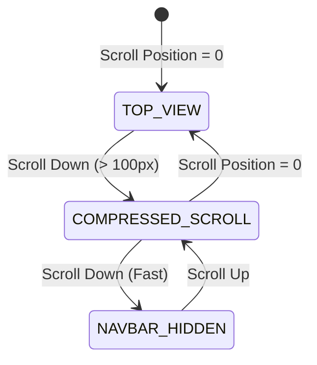

# Master Navigation System Blueprint: "NEURAL TRANSIT HUD"
*Cinematic navigation architecture, scrollspy state machinery, and interactive motion rules for the portfolio HUD.*

This document establishes the master UX and frontend engineering specifications for the navigation system, ensuring it maintains structural orientation and high visual polish.

---

## 1. Navbar Layout Architecture

The navigation bar functions as a persistent **Heads-Up Display (HUD)**, framing the top boundary of the viewport.

```
+-------------------------------------------------------------------------------------+
| LOGO: [OP_01]                BREADCRUMBS: Home / Skills                 [ 19:24 UTC ]|
| . . . . . . . . . . . . . . . . . . . . . . . . . . . . . . . . . . . . . . . . . . |  <-- SVG Dotted separator
+-------------------------------------------------------------------------------------+
```

### Layout Elements
*   **The Left Pivot (Identity):** The Text Logo `[OP_01 // Ayan]` in bold monospace font.
*   **The Center Pivot (Dynamic Context):** A scrollspy-driven breadcrumb path (e.g. `Home / Expertise / Reinforcement Learning`).
*   **The Right Pivot (System Clock):** A real-time UTC clock updating every second in a monospaced layout (`font-mono`).
*   **The Sub-Separators:** A horizontal SVG dotted line separating the navigation HUD from the scrolling viewport content.

---

## 2. Scroll Behavior Logic & State Machine

The navbar responds to scrolling changes through a scroll direction listener loop:



1.  **Transparent-to-Solid Transition:**
    *   At `scrollTop < 100px`, the navbar background is transparent.
    *   At `scrollTop >= 100px`, the navbar backdrop fills with a translucent glass layer:
        ```css
        background-color: hsla(var(--bg-canvas), 0.75);
        backdrop-filter: blur(12px);
        border-bottom: 1px solid hsla(var(--border-muted), 0.3);
        ```
2.  **Scroll-Aware Visibility (Autohide):**
    *   *Scrolling Down:* Navbar translates vertically out of view (`transform: translateY(-100%)`) over `300ms` to maximize screen focus. Easing: `$ease-out-expo`.
    *   *Scrolling Up:* Navbar translates back into view (`transform: translateY(0%)`) over `200ms` for instant access.

---

## 3. Active Section Tracking (Scrollspy)

The breadcrumbs in the navbar center are synchronized with scroll thresholds using a hook:

*   **IntersectionObserver Logic:**
    Every section (e.g., `#hero`, `#expertise`, `#projects`) is registered with an IntersectionObserver.
    ```javascript
    const observerOptions = {
      root: null,
      rootMargin: "-20% 0px -60% 0px", // Focuses on the upper-middle region of the viewport
      threshold: 0.15,
    };
    ```
*   **State Injection:** When a section enters the target viewport region, its name is committed to the global Zustand store, updating the center navbar breadcrumbs text dynamically.

---

## 4. Hover Interaction & Focus Language

Links and menu buttons respond with quiet, high-friction transformations:

*   **Prefix Stagger:** Hovering links does not create outlines or underscores. Instead, a monospaced character tag (e.g., `[01]`) fades in (`opacity: 1`, duration `150ms`) and translates `4px` to the right, pushing the link text.
*   **CRT Glow:** Link text shifts from CRT off-white to solid Phosphor Mint (`var(--color-accent)`) with a subtle text shadow glow (`rgba(79, 250, 157, 0.3)`).

---

## 5. Mobile Navigation Strategy

We reject typical slide-out menus in favor of a fullscreen **System HUD Dashboard**:

*   **The Menu Trigger:** A minimal button: `[ MENU // [ ] ]`. On click, it converts to `[ CLOSE // [X] ]`.
*   **The Fullscreen Overlay:** Slides down from the top using `$ease-in-out-expo` (duration `500ms`), featuring:
    *   Large asymmetric menu links (`70vh` text list).
    *   Client logos marquee moving in opposite directions.
    *   Location and contact coordinates displayed in small monospace cells.
*   **Animation Stagger:** Menu items fade and slide up row-by-row with a stagger delay of `40ms` per item.

---

## 6. Accessibility & Keyboard HUD

*   **Keyboard Navigation HUD:** Pressing `Ctrl+0` spawns the navigation panel. Users can press numeric shortcuts (e.g., `1` to `9`) to scroll to target page sections instantly.
*   **ARIA Focus Trap:** When the mobile fullscreen menu is active, focus is locked inside the dialog container (`focus-trap-react`) to prevent keyboard tabbing from leaking to background links.
*   **Reduced Motion:** Scroll translations and menu slides are converted to instant opacity fades if the user's OS has `prefers-reduced-motion` enabled.
